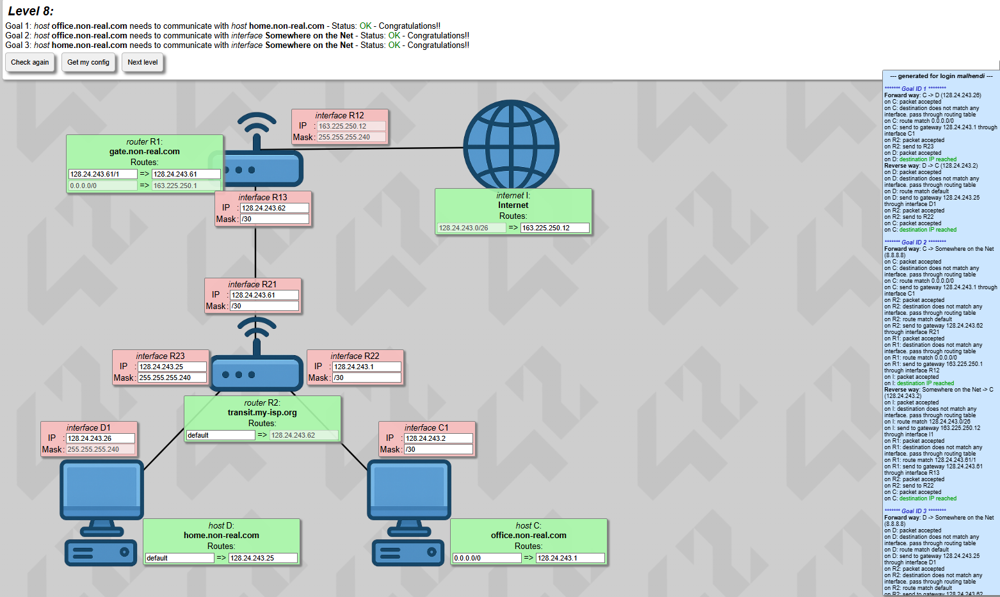
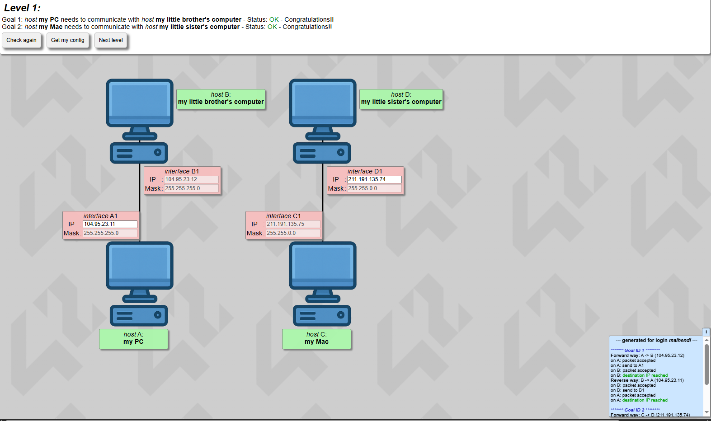
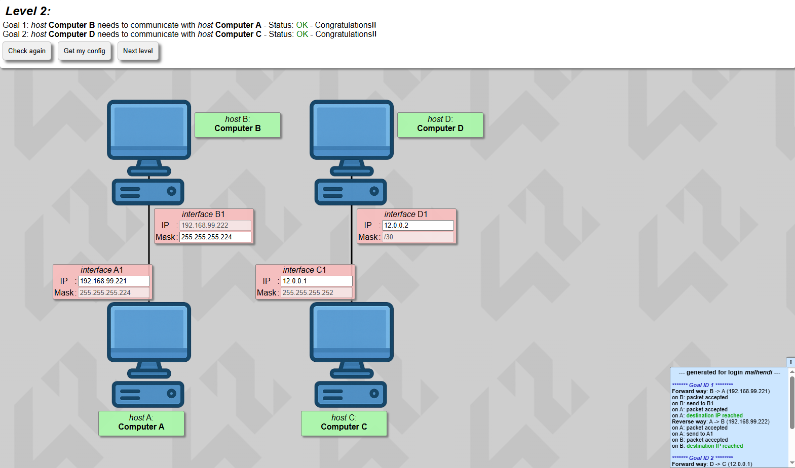
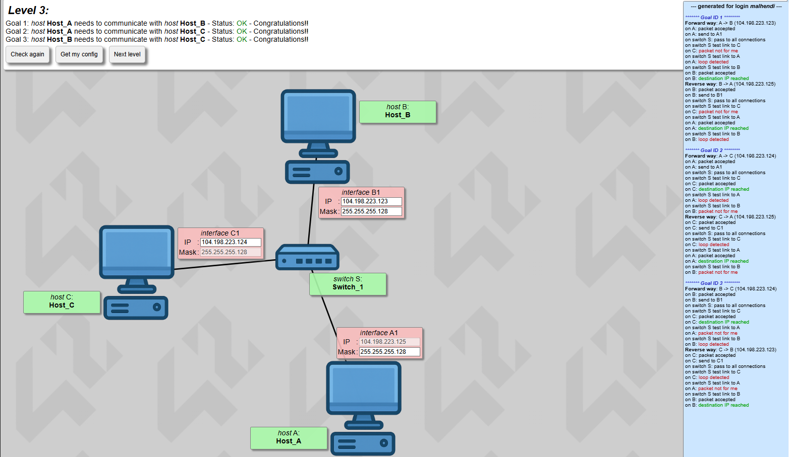
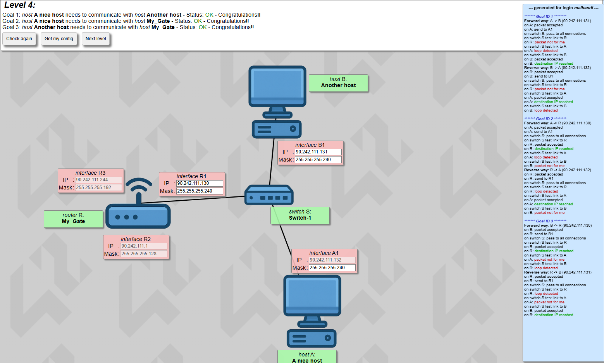
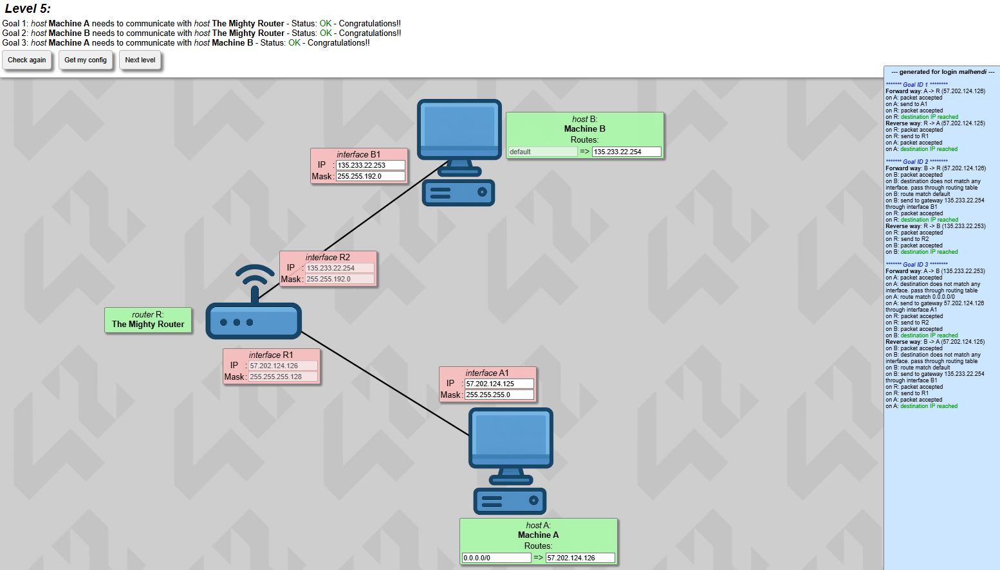
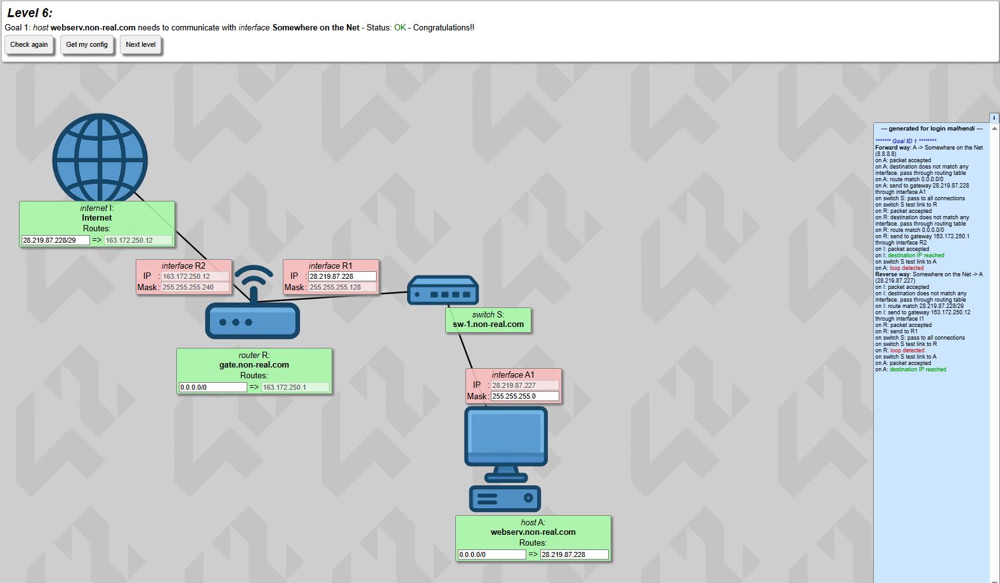
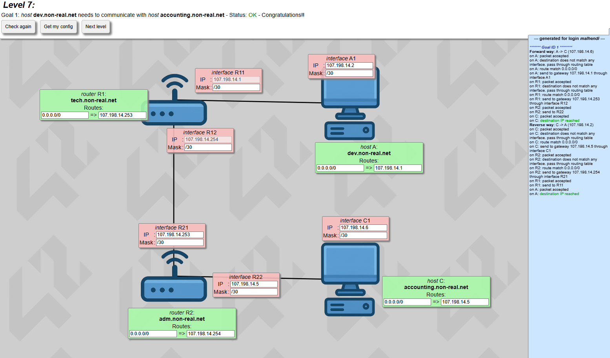
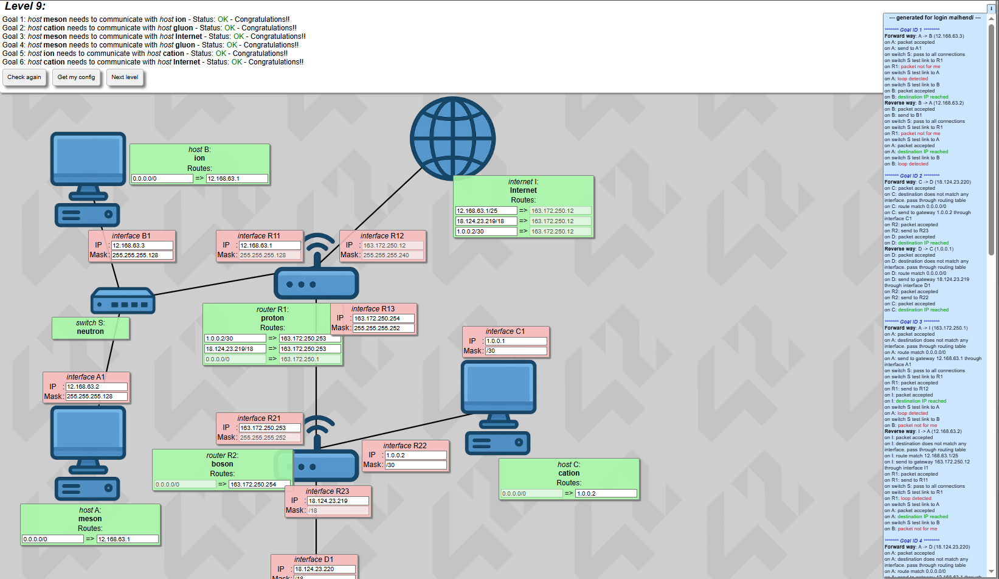
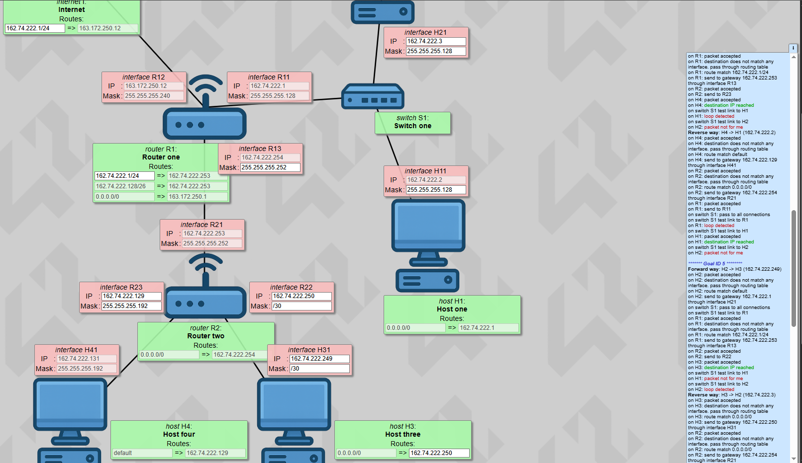

# NetPractice

<p align="center">
  
</p>

<p align="center">
  
  
  
</p>

## About

This repository contains my solutions and explanations for the **NetPractice** project from the **42 curriculum**.

NetPractice is a networking project focused on configuring IPv4 addresses, subnet masks, gateways, and routing tables to make different hosts communicate correctly.

The purpose of this repository is not just to store the final answers, but to document the way I think through each level, how I split the network, how I choose valid subnets, and how I debug routing errors.

This guide is written as a study reference for myself and for anyone learning the basics of networking through NetPractice.

---

## Contents

* [Repository Structure](#repository-structure)
* [Basics](#basics)

  * [IPv4 Addresses](#ipv4-addresses)
  * [Special IP Ranges](#special-ip-ranges)
  * [Masks](#masks)
  * [Switches](#switches)
  * [Routers](#routers)
  * [Routing Tables](#routing-tables)
  * [Network Logic](#network-logic)
* [How I Approach NetPractice](#how-i-approach-netpractice)
* [Common Errors](#common-errors)
* [Levels](#levels)

  * [Level 1](#level-1)
  * [Level 2](#level-2)
  * [Level 3](#level-3)
  * [Level 4](#level-4)
  * [Level 5](#level-5)
  * [Level 6](#level-6)
  * [Level 7](#level-7)
  * [Level 8](#level-8)
  * [Level 9](#level-9)
  * [Level 10](#level-10)
* [42 Note](#42-note)
* [Author](#author)

---

## Repository Structure

```text
.
├── README.md
├── img/
│   ├── level1.png
│   ├── level2.png
│   ├── level3.png
│   ├── level4.png
│   ├── level5.png
│   ├── level6.png
│   ├── level7.png
│   ├── level8.png
│   ├── level9.png
│   └── level10.png
└── solution/
    ├── level1.json
    ├── level2.json
    ├── level3.json
    ├── level4.json
    ├── level5.json
    ├── level6.json
    ├── level7.json
    ├── level8.json
    ├── level9.json
    └── level10.json
```

| Folder      | Description                                                |
| ----------- | ---------------------------------------------------------- |
| `img/`      | Contains screenshots for every solved level                |
| `solution/` | Contains the exported NetPractice JSON configuration files |
| `README.md` | Contains the explanation, concepts, and level walkthroughs |

---

## Basics

For this project, we only deal with **IPv4**.

An IPv4 address is a 32-bit number divided into four blocks. Each block is 8 bits.

Example:

```text
192.168.100.1
```

In binary:

```text
11000000.10101000.01100100.00000001
```

Each block can have a value from:

```text
0 to 255
```

The same binary logic applies to subnet masks.

Example:

```text
255.255.255.0
```

In binary:

```text
11111111.11111111.11111111.00000000
```

After a bit becomes `0` in a subnet mask, there cannot be any `1` bits after it.

That is why these values are valid inside masks:

```text
255 = 11111111
254 = 11111110
252 = 11111100
248 = 11111000
240 = 11110000
224 = 11100000
192 = 11000000
128 = 10000000
0   = 00000000
```

So this is a valid mask:

```text
255.255.255.0
```

But this is not a valid mask:

```text
255.255.128.128
```

because after the mask starts using `0` bits, it cannot go back to `1` bits.

---

## IPv4 Addresses

An IP address identifies an interface inside a network.

In NetPractice, we do not configure devices directly. We configure their interfaces.

Example:

```text
interface A1
IP:   192.168.1.2
Mask: 255.255.255.0
```

This means interface `A1` belongs to the network:

```text
192.168.1.0/24
```

Two devices can communicate directly only if they are in the same network, or if there is a router between their networks.

---

## Special IP Ranges

Some IP ranges are reserved for private networks.

These private ranges are:

```text
10.0.0.0      - 10.255.255.255
172.16.0.0    - 172.31.255.255
192.168.0.0   - 192.168.255.255
```

The loopback range is:

```text
127.0.0.0 - 127.255.255.255
```

For NetPractice, the most important thing is not whether an IP is public or private. The most important thing is whether the IP belongs to the correct subnet.

---

## Masks

A subnet mask decides which IP addresses are part of the same network.

There are two common ways to write a subnet mask:

```text
Dot-decimal notation: 255.255.255.0
CIDR notation:        /24
```

Example:

```text
192.168.1.10/24
```

means:

```text
IP:   192.168.1.10
Mask: 255.255.255.0
```

The first address in a subnet is the **network address**.

The last address in a subnet is the **broadcast address**.

Both cannot be assigned to devices.

---

### Subnet Cheat Sheet

|  CIDR |  Dot-decimal Mask | Total IPs | Usable IPs |
| ----: | ----------------: | --------: | ---------: |
| `/32` | `255.255.255.255` |         1 |          0 |
| `/31` | `255.255.255.254` |         2 |          0 |
| `/30` | `255.255.255.252` |         4 |          2 |
| `/29` | `255.255.255.248` |         8 |          6 |
| `/28` | `255.255.255.240` |        16 |         14 |
| `/27` | `255.255.255.224` |        32 |         30 |
| `/26` | `255.255.255.192` |        64 |         62 |
| `/25` | `255.255.255.128` |       128 |        126 |
| `/24` |   `255.255.255.0` |       256 |        254 |
| `/16` |     `255.255.0.0` |     65536 |      65534 |

Example with `/30`:

```text
Network:   190.3.2.252
Usable:    190.3.2.253
Usable:    190.3.2.254
Broadcast: 190.3.2.255
```

Only the usable IP addresses can be assigned to interfaces.

---

## Switches

A switch connects multiple devices inside the same network.

A switch does not separate networks.

If several devices are connected to the same switch, they usually need to be in the same subnet.

Example:

```text
Host A
Host B
Router interface
```

If all of them are connected to the same switch, they should share the same network.

---

## Routers

A router connects different networks.

A router can have multiple interfaces, and each interface usually belongs to a different subnet.

Example:

```text
R1 interface 1 -> Network A
R1 interface 2 -> Network B
```

The router can forward packets between these networks only if the routes are correct.

A router does not magically know every network. It only knows:

1. Networks directly connected to its own interfaces.
2. Networks manually added in its routing table.

---

## Routing Tables

A routing table tells a host or router where to send packets.

In NetPractice, a route has two parts:

```text
Destination => Next hop
```

Example:

```text
192.168.2.0/24 => 192.168.1.1
```

Meaning:

```text
To reach 192.168.2.0/24, send the packet to 192.168.1.1.
```

The left side is the destination network.

The right side is the next hop or gateway.

Important rule:

```text
The gateway must be directly reachable.
```

That means the gateway must be in the same subnet as one of the sender's interfaces.

---

### Default Route

A default route is used when no more specific route matches.

It can be written as:

```text
default
```

or:

```text
0.0.0.0/0
```

Both mean:

```text
Any destination.
```

Example:

```text
0.0.0.0/0 => 192.168.1.1
```

This means:

```text
Send all unknown traffic to 192.168.1.1.
```

---

## Network Logic

To know whether two devices are part of the same network, combine the IP address with the subnet mask.

This is done using a bit-by-bit AND operation.

Example:

```text
IP:   192.168.100.1
Mask: 255.255.255.0
```

Binary:

```text
IP:   11000000.10101000.01100100.00000001
Mask: 11111111.11111111.11111111.00000000
```

Result:

```text
11000000.10101000.01100100.00000000
```

In dot-decimal:

```text
192.168.100.0
```

So the network is:

```text
192.168.100.0/24
```

If two devices have the same network address, they are in the same network.

If they are not in the same network, they need a router to communicate.

---

## How I Approach NetPractice

My solving process:

1. Read the goal.
2. Identify which hosts need to communicate.
3. Split the topology into separate networks.
4. Check all directly connected interfaces.
5. Make sure devices on the same link are in the same subnet.
6. Avoid network and broadcast addresses.
7. Set host gateways to the nearest router.
8. Add routes on routers for remote networks.
9. Add reverse routes when the Internet is involved.
10. Read the logs and fix the first real error.

The most important rule:

```text
Do not solve the whole diagram at once.
Split it into small networks first.
```

---

## Common Errors

| Error                                      | Meaning                                       | Fix                                        |
| ------------------------------------------ | --------------------------------------------- | ------------------------------------------ |
| `invalid IP address`                       | The IP is a network or broadcast address      | Choose a usable IP                         |
| `no route`                                 | A route is missing                            | Add a route to the destination network     |
| `invalid route`                            | The gateway is not reachable                  | Use a gateway in the same subnet           |
| `loop detected`                            | Traffic is being sent back and forth          | Fix wrong default routes                   |
| `wrong host`                               | The IP exists on the wrong device             | Check duplicate IPs or overlapping subnets |
| `no reverse way`                           | Forward path works but return path is missing | Add the return route                       |
| `route match but no interface for gateway` | The gateway is not directly reachable         | Use the correct next hop                   |

---

## Levels

Here are the solutions and explanations for all 10 levels.

---

## Level 1

<details>
<summary><strong>show</strong></summary>

<br>



### Goal

This level has two separate communication goals:

```text
A <--> B
C <--> D
```

There are no routers.

---

### Explanation

Each pair of hosts is directly connected.

That means:

```text
A1 and B1 must be in the same subnet.
C1 and D1 must be in the same subnet.
```

No gateway is needed because there is no router.

---

### Why It Works

For the first connection:

```text
A1 = 104.95.23.11
B1 = 104.95.23.12
Mask = 255.255.255.0
```

Both are inside:

```text
104.95.23.0/24
```

For the second connection:

```text
C1 = 211.191.135.75
D1 = 211.191.135.74
Mask = 255.255.0.0
```

Both are inside:

```text
211.191.0.0/16
```

So both pairs can communicate directly.

---

### Key Takeaway

Directly connected devices must be part of the same subnet.

---

### Solution File

[`solution/level1.json`](solution/level1.json)

</details>

[back to contents](#contents)

---

## Level 2

<details>
<summary><strong>show</strong></summary>

<br>



### Goal

This level focuses on making directly connected devices communicate by fixing IP addresses and subnet masks.

---

### Explanation

When two interfaces are directly connected, they must belong to the same subnet.

A gateway is not needed unless the destination is outside the local network.

---

### How to Think

For each connected pair:

1. Read the IP address.
2. Read the mask.
3. Calculate the network.
4. Make sure both interfaces belong to the same network.
5. Make sure neither IP is the network address or broadcast address.

---

### Key Takeaway

The IP address alone is not enough.

You must always check:

```text
IP + Mask
```

---

### Solution File

[`solution/level2.json`](solution/level2.json)

</details>

[back to contents](#contents)

---

## Level 3

<details>
<summary><strong>show</strong></summary>

<br>



### Goal

This level has three communication goals:

```text
A <--> B
A <--> C
B <--> C
```

All three hosts are connected to the same switch.

---

### Network Topology

The topology can be simplified like this:

```text
        Switch S
       /   |   \
      A    B    C
```

There is no router in this level.

That means all connected hosts must be part of the same local network.

---

### Network Analysis

The switch connects all hosts inside the same network.

A switch does not separate networks.
It only forwards traffic between devices connected to it.

So the important rule here is:

```text
A, B, and C must be in the same subnet.
```

From the successful log, the hosts communicate using these IP addresses:

```text
A = 104.198.223.125
B = 104.198.223.123
C = 104.198.223.124
```

All of them are inside the same IP range:

```text
104.198.223.x
```

So they can communicate directly through the switch.

---

### Why No Gateway Is Needed

There is no router in this level.

Since all hosts are in the same subnet, packets do not need to leave the local network.

So no default gateway is required.

The hosts can send packets directly to each other through the switch.

---

### Understanding the Log

Example from Goal 1:

```text
Forward way: A -> B
on A: packet accepted
on A: send to A1
on switch S: pass to all connections
on B: packet accepted
on B: destination IP reached
```

This means:

1. Host A accepted the packet.
2. A sent the packet through interface `A1`.
3. The switch forwarded the packet to connected devices.
4. Host B received the packet.
5. The destination was reached successfully.

---

### Why `packet not for me` Appears

In the log, we also see:

```text
on C: packet not for me
```

This is normal.

Because the switch forwards traffic to connected devices, another host may see the packet but ignore it if the destination IP is not its own IP.

So when A sends a packet to B, host C may receive the packet but rejects it because it is not the destination.

---

### Why `loop detected` Appears

The log also shows:

```text
on A: loop detected
```

or:

```text
on B: loop detected
```

In this level, this is not the main problem because the final result is successful.

The important line is:

```text
destination IP reached
```

The switch tests all connected links, including the sender itself.
When the packet is seen again by the original sender, NetPractice marks it as a loop in the log.

As long as the destination is reached and the status is `OK`, this is not an issue for this level.

---

### Final Result

All communication goals work:

```text
A -> B : OK
A -> C : OK
B -> C : OK
```

And the reverse paths also work:

```text
B -> A : OK
C -> A : OK
C -> B : OK
```

---

### Key Takeaway

When multiple hosts are connected to the same switch:

```text
They must belong to the same subnet.
```

A switch does not route traffic between networks.

If the hosts are in different subnets, a router would be needed.

---

### Best Practice

For a switch network, count how many usable IP addresses are needed.

In this level, there are three hosts:

```text
A
B
C
```

So the subnet must provide at least three usable IP addresses.

A `/30` would not be enough because it gives only two usable IP addresses.

A `/29` or larger subnet would work because `/29` gives six usable IP addresses.

---

### Solution File

[`solution/level3.json`](solution/level3.json)

</details>

[back to contents](#contents)

---

## Level 4

<details>
<summary><strong>show</strong></summary>

<br>



### Goal

This level has three communication goals:

```text id="vu9jqx"
A <--> B
A <--> R
B <--> R
```

Hosts `A` and `B` are connected to the same switch as router `R`.

---

### Network Topology

The topology can be simplified like this:

```text id="jeagfo"
        Switch S
       /   |   \
      A    B    R
```

There is one switch and one router interface connected to that switch.

Even though a router exists in the level, the communication goals are still inside the same local network.

---

### Network Analysis

A switch connects devices inside the same network.

In this level, the devices connected to the switch are:

```text id="av0mah"
A
B
R
```

So the interfaces of these devices must belong to the same subnet.

From the successful log, the important IP addresses are:

```text id="4ix0i8"
A = 90.242.111.132
B = 90.242.111.131
R = 90.242.111.130
```

All of them are in the same IP range:

```text id="kedrlu"
90.242.111.x
```

So they can communicate through the switch.

---

### Router Role in This Level

The router `R` is present, but it is not used to route traffic between different networks in this level.

Here, `R` behaves like another device connected to the same switch.

That means `A`, `B`, and `R` must all be in the same subnet.

No extra routing table configuration is needed for these goals.

---

### Understanding the Log

Example from Goal 2:

```text id="92tpbo"
Forward way: A -> R
on A: packet accepted
on A: send to A1
on switch S: pass to all connections
on R: packet accepted
on R: destination IP reached
```

This means:

1. Host A accepted the packet.
2. A sent the packet through interface `A1`.
3. The switch forwarded the packet.
4. Router R received the packet.
5. The destination was reached successfully.

---

### Why `packet not for me` Appears

The log contains lines like:

```text id="x8dozy"
on R: packet not for me
```

or:

```text id="q5hu1u"
on A: packet not for me
```

This happens because the switch forwards traffic to connected links.

If a device receives a packet that is not addressed to its own IP, it ignores it.

This is normal in this level.

---

### Why `loop detected` Appears

The log also contains:

```text id="wegg0n"
loop detected
```

In this level, the final result is still correct because the destination is reached.

The switch tests multiple links, including the link back toward the sender.

As long as NetPractice shows `OK` and the destination is reached, this message is not the main issue here.

---

### Final Result

All goals work:

```text id="8p3rpe"
A -> B : OK
A -> R : OK
B -> R : OK
```

The reverse paths also work:

```text id="6pwdri"
B -> A : OK
R -> A : OK
R -> B : OK
```

---

### Key Takeaway

A router interface connected to a switch must be in the same subnet as the other devices on that switch.

The router only becomes useful for routing when traffic needs to leave this local network.

---

### Best Practice

When a switch connects multiple devices, count how many usable IP addresses are needed.

In this level, the switch connects three interfaces:

```text id="y8e0xh"
A1
B1
R1
```

So the subnet must provide at least three usable IP addresses.

A `/30` is not enough because it provides only two usable IP addresses.

A `/29` or larger subnet would be enough.

---

### Solution File

[`solution/level4.json`](solution/level4.json)

</details>

[back to contents](#contents)

---

## Level 5

<details>
<summary><strong>show</strong></summary>

<br>



### Goal

This level has three communication goals:

```text id="hmhnr1"
A <--> R
B <--> R
A <--> B
```

There is one router between two different host networks.

---

### Network Topology

The topology can be simplified like this:

```text id="g5t8f2"
A <--> R <--> B
```

Router `R` has two interfaces:

```text id="mp84zg"
R1 connected to A
R2 connected to B
```

This means there are two separate networks:

```text id="bqxqrn"
Network 1: A + R1
Network 2: B + R2
```

---

### Network Analysis

Host `A` and router interface `R1` are directly connected.

From the log:

```text id="8h9tgm"
A = 57.202.124.125
R1 = 57.202.124.126
```

So `A` and `R1` must be in the same subnet.

Host `B` and router interface `R2` are also directly connected.

From the log:

```text id="gal1xe"
B  = 135.233.22.253
R2 = 135.233.22.254
```

So `B` and `R2` must be in the same subnet.

---

### Why Gateways Are Needed

For Goal 1:

```text id="apdjz5"
A -> R
```

A can reach R directly through `R1`.

For Goal 2:

```text id="q9omj6"
B -> R
```

B can reach R directly through `R2`.

But for Goal 3:

```text id="udpdvi"
A -> B
```

A and B are not in the same network.

So A must send the packet to its gateway, which is router `R`.

The same applies in the reverse direction:

```text id="wc4hy0"
B -> A
```

B must send the packet to router `R`.

---

### Understanding the Log

From Goal 3:

```text id="hsyaio"
Forward way: A -> B
on A: destination does not match any interface
on A: route match 0.0.0.0/0
on A: send to gateway 57.202.124.126 through interface A1
on R: packet accepted
on R: send to R2
on B: destination IP reached
```

This shows the correct path:

```text id="mms1vl"
A -> R -> B
```

A does not know B directly, so it sends the packet to its gateway:

```text id="13i3qs"
57.202.124.126
```

That gateway is router interface `R1`.

Then the router forwards the packet through `R2` to B.

---

### Reverse Path

The reverse path is also correct:

```text id="nlqg48"
B -> R -> A
```

From the log:

```text id="x3lcmh"
on B: route match default
on B: send to gateway 135.233.22.254 through interface B1
on R: packet accepted
on R: send to R1
on A: destination IP reached
```

B sends traffic to its gateway:

```text id="wc3k45"
135.233.22.254
```

That gateway is router interface `R2`.

The router then forwards the packet back through `R1` to A.

---

### Final Result

All goals work:

```text id="34lra9"
A -> R : OK
B -> R : OK
A -> B : OK
```

And the reverse paths also work:

```text id="0deaua"
R -> A : OK
R -> B : OK
B -> A : OK
```

---

### Key Takeaway

When two hosts are in different networks, they need a router between them.

Each host should use the router interface connected to its own network as its gateway.

---

### Best Practice

For two-device links, use the smallest subnet that fits two usable IP addresses.

A `/30` is usually enough for:

```text id="z3no62"
A <--> R
B <--> R
```

because `/30` gives exactly two usable IP addresses.

---

### Solution File

[`solution/level5.json`](solution/level5.json)

</details>

[back to contents](#contents)

---

## Level 6

<details>
<summary><strong>show</strong></summary>

<br>



### Goal

This level has one main communication goal:

```text
A <--> Somewhere on the Net
```

Host `A` must be able to reach the Internet, and the Internet must be able to send the response back to `A`.

---

### Network Topology

The topology can be simplified like this:

```text
A --- Switch S --- R --- Internet
```

Router `R` has two sides:

```text
R1 connected to A through the switch
R2 connected to the Internet
```

So we have two main networks:

```text
Network 1: A + R1
Network 2: R2 + Internet
```

---

### Network Analysis

Host `A` is not directly connected to the Internet.

So when `A` wants to reach an outside destination, such as:

```text
8.8.8.8
```

it must send the packet to its gateway.

From the log:

```text
A sends to gateway 28.219.87.228 through interface A1
```

That means:

```text
A gateway = 28.219.87.228
```

This gateway is router `R` on the local network side.

---

### Forward Path

The forward path is:

```text
A -> R -> Internet
```

From the log:

```text
on A: route match 0.0.0.0/0
on A: send to gateway 28.219.87.228 through interface A1
on R: route match 0.0.0.0/0
on R: send to gateway 163.172.250.1 through interface R2
on I: destination IP reached
```

This means:

1. `A` does not have the Internet network directly connected.
2. `A` uses its default route.
3. `A` sends the packet to router `R`.
4. `R` also uses its default route.
5. `R` sends the packet to the Internet gateway.
6. The Internet destination is reached.

---

### Reverse Path

The reverse path is:

```text
Internet -> R -> A
```

From the log:

```text
Reverse way: Somewhere on the Net -> A
on I: route match 28.219.87.228/29
on I: send to gateway 163.172.250.12 through interface I1
on R: send to R1
on A: destination IP reached
```

This shows that the Internet side has a route back to the internal network.

The important idea is:

```text
The Internet must know how to return traffic to A.
```

Without this reverse route, the forward path may work, but the level would fail with:

```text
No reverse way
```

---

### Why the Internet Route Matters

When `A` sends traffic to the Internet, the reply destination becomes `A`.

In this level, the reply goes back to:

```text
28.219.87.227
```

So the Internet box needs a route that points back toward the internal network through router `R`.

The route idea is:

```text
A network => R interface connected to Internet
```

From the log, the Internet sends the packet to:

```text
163.172.250.12
```

That is the router interface connected to the Internet side.

---

### Why `loop detected` Appears

The log contains:

```text
on A: loop detected
```

and:

```text
on R: loop detected
```

In this level, this is not the actual problem because the packet still reaches the destination.

The switch tests multiple connected links, including the sender side.

The important line is:

```text
destination IP reached
```

As long as both the forward path and reverse path reach the destination, the level is correct.

---

### Final Result

The communication works in both directions:

```text
A -> Internet : OK
Internet -> A : OK
```

---

### Key Takeaway

When the Internet is involved, always check two things:

```text
1. The host has a default route to the router.
2. The Internet has a reverse route back to the host network.
```

Forward traffic alone is not enough.

The return path must also be valid.

---

### Best Practice

For Internet levels, debug in this order:

```text
1. Check the host gateway.
2. Check the router default route to the Internet.
3. Check the Internet reverse route.
4. Make sure every gateway is directly reachable.
```

Do not only check the forward path.

Most Internet-level mistakes happen because the reverse route is missing or points to the wrong gateway.

---

### Solution File

[`solution/level6.json`](solution/level6.json)

</details>

[back to contents](#contents)

---

## Level 7

<details>
<summary><strong>show</strong></summary>

<br>



### Goal

This level has one main communication goal:

```text
A <--> C
```

Host `A` must communicate with host `C` through two routers.

---

### Network Topology

The topology can be simplified like this:

```text
A <--> R1 <--> R2 <--> C
```

There are three separate networks:

```text
Network 1: A + R1
Network 2: R1 + R2
Network 3: R2 + C
```

This is the first level where the path clearly goes through multiple routers.

---

### Network Analysis

Host `A` is not directly connected to host `C`.

So `A` must send the packet to its nearest router, which is `R1`.

From the log:

```text
A sends to gateway 107.198.14.1 through interface A1
```

So the first hop is:

```text
A -> R1
```

Then `R1` forwards the packet to `R2`.

From the log:

```text
R1 sends to gateway 107.198.14.253 through interface R12
```

Then `R2` forwards the packet to host `C`.

From the log:

```text
R2 sends to R22
C receives the packet
destination IP reached
```

So the complete forward path is:

```text
A -> R1 -> R2 -> C
```

---

### Forward Path

The forward path from `A` to `C` is:

```text
A -> R1 -> R2 -> C
```

From the log:

```text
Forward way: A -> C
on A: route match 0.0.0.0/0
on A: send to gateway 107.198.14.1 through interface A1
on R1: route match 0.0.0.0/0
on R1: send to gateway 107.198.14.253 through interface R12
on R2: send to R22
on C: destination IP reached
```

This shows that:

1. `A` does not know `C` directly.
2. `A` sends traffic to its default gateway, `R1`.
3. `R1` forwards the packet to `R2`.
4. `R2` delivers the packet to `C`.

---

### Reverse Path

The reverse path from `C` back to `A` is:

```text
C -> R2 -> R1 -> A
```

From the log:

```text
Reverse way: C -> A
on C: route match 0.0.0.0/0
on C: send to gateway 107.198.14.5 through interface C1
on R2: route match 0.0.0.0/0
on R2: send to gateway 107.198.14.254 through interface R21
on R1: send to R11
on A: destination IP reached
```

This confirms that the return route is also correct.

The packet does not only need a way to reach `C`; it also needs a valid path back to `A`.

---

### Router-to-Router Link

The middle network is the connection between `R1` and `R2`.

From the log, the router-to-router communication uses:

```text
R1 sends to 107.198.14.253
R2 sends back to 107.198.14.254
```

This means the interfaces between `R1` and `R2` must be in the same subnet.

A router-to-router link is usually a point-to-point network, so a small subnet like `/30` is usually enough.

---

### Why Default Routes Work Here

In this level, the path is linear:

```text
A -> R1 -> R2 -> C
```

There is only one direction to go from each host or router toward the remote network.

That is why default routes can work well here:

```text
0.0.0.0/0 => next router
```

But the default route must point to the correct next hop.

Wrong default routes can easily create loops.

---

### Final Result

The communication works in both directions:

```text
A -> C : OK
C -> A : OK
```

---

### Key Takeaway

When traffic crosses multiple routers, every router must know the next hop toward the destination.

The forward path and reverse path must both be valid.

---

### Best Practice

For this type of topology, solve in this order:

```text
1. Configure A with R1.
2. Configure R1 with R2.
3. Configure R2 with C.
4. Add the route from A toward C.
5. Add the route from C back toward A.
6. Check that R1 and R2 point to each other correctly.
```

Do not start by guessing routes.

First split the topology into separate networks.

---

### Solution File

[`solution/level7.json`](solution/level7.json)

</details>

[back to contents](#contents)

---

## Level 8

<details>
<summary><strong>show</strong></summary>

<br>


### Goal

This level has three communication goals:

```text
C <--> D
C <--> Somewhere on the Net
D <--> Somewhere on the Net
```

Hosts `C` and `D` must communicate with each other, and both of them must also reach the Internet.

---

### Network Topology

The topology can be simplified like this:

```text
C <--> R2 <--> R1 <--> Internet
       |
       D
```

More precisely, the network is split into these parts:

```text
Network 1: C + R2
Network 2: D + R2
Network 3: R2 + R1
Network 4: R1 + Internet
```

This level is mainly about routing traffic from internal networks to the Internet and making sure the Internet can return the traffic correctly.

---

### Network Analysis

Host `C` is connected to router `R2`.

From the log:

```text
C sends to gateway 128.24.243.1 through interface C1
```

So `C` uses `R2` as its gateway.

Host `D` is also connected to router `R2`.

From the log:

```text
D sends to gateway 128.24.243.25 through interface D1
```

So `D` also uses `R2` as its gateway, but through a different router interface.

Then `R2` sends traffic upward to `R1`:

```text
R2 sends to gateway 128.24.243.62 through interface R21
```

Finally, `R1` sends traffic to the Internet:

```text
R1 sends to gateway 163.225.250.1 through interface R12
```

So the Internet path is:

```text
C/D -> R2 -> R1 -> Internet
```

---

### Goal 1: C to D

The first goal is local internal routing between `C` and `D`.

Forward path:

```text
C -> R2 -> D
```

From the log:

```text
Forward way: C -> D
on C: route match 0.0.0.0/0
on C: send to gateway 128.24.243.1 through interface C1
on R2: send to R23
on D: destination IP reached
```

Reverse path:

```text
D -> R2 -> C
```

From the log:

```text
Reverse way: D -> C
on D: route match default
on D: send to gateway 128.24.243.25 through interface D1
on R2: send to R22
on C: destination IP reached
```

This works because both hosts use `R2` as their gateway.

---

### Goal 2: C to Internet

The forward path from `C` to the Internet is:

```text
C -> R2 -> R1 -> Internet
```

From the log:

```text
on C: send to gateway 128.24.243.1 through interface C1
on R2: send to gateway 128.24.243.62 through interface R21
on R1: send to gateway 163.225.250.1 through interface R12
on I: destination IP reached
```

This confirms that the forward route works.

The reverse path is:

```text
Internet -> R1 -> R2 -> C
```

From the log:

```text
on I: route match 128.24.243.0/26
on I: send to gateway 163.225.250.12 through interface I1
on R1: send to gateway 128.24.243.61 through interface R13
on R2: send to R22
on C: destination IP reached
```

This means the Internet has a route back to the internal network.

---

### Goal 3: D to Internet

The forward path from `D` to the Internet is:

```text
D -> R2 -> R1 -> Internet
```

From the log:

```text
on D: send to gateway 128.24.243.25 through interface D1
on R2: send to gateway 128.24.243.62 through interface R21
on R1: send to gateway 163.225.250.1 through interface R12
on I: destination IP reached
```

The reverse path is:

```text
Internet -> R1 -> R2 -> D
```

From the log:

```text
on I: route match 128.24.243.0/26
on I: send to gateway 163.225.250.12 through interface I1
on R1: send to gateway 128.24.243.61 through interface R13
on R2: send to R23
on D: destination IP reached
```

This confirms that Internet replies can return to both internal hosts.

---

### Why the Internet Route Is Important

The Internet must know how to return traffic to the internal network.

In this level, the Internet route matches:

```text
128.24.243.0/26
```

and sends the packet to:

```text
163.225.250.12
```

That IP is the router interface connected to the Internet side.

The idea is:

```text
Internal network => R1 interface connected to Internet
```

Without this route, the forward path may reach the Internet, but the reverse path would fail with:

```text
No reverse way
```

---

### Why R1 Needs a Route Back to R2

When the Internet sends the packet back to `R1`, `R1` must know that the internal hosts are behind `R2`.

From the log:

```text
on R1: send to gateway 128.24.243.61 through interface R13
```

That means `R1` sends internal traffic back to `R2`.

So the return path becomes:

```text
Internet -> R1 -> R2 -> C/D
```

---

### Final Result

All goals work:

```text
C -> D        : OK
C -> Internet : OK
D -> Internet : OK
```

And all reverse paths work:

```text
D -> C        : OK
Internet -> C : OK
Internet -> D : OK
```

---

### Key Takeaway

This level is about complete routing, not just forward routing.

For Internet communication, the network needs:

```text
1. Host default gateways
2. R2 route toward R1
3. R1 default route toward Internet
4. Internet reverse route toward the internal network
5. R1 route back toward R2
```

Every step must work in both directions.

---

### Best Practice

For levels with Internet and multiple routers, solve in this order:

```text
1. Make C reach D internally.
2. Make C and D reach R2.
3. Make R2 reach R1.
4. Make R1 reach the Internet.
5. Add the Internet reverse route.
6. Check that R1 sends returning traffic back to R2.
```

Do not stop when the forward path reaches the Internet.

Always verify the reverse path.

---

### Solution File

[`solution/level8.json`](solution/level8.json)

</details>

[back to contents](#contents)

---

## Level 9

<details>
<summary><strong>show</strong></summary>

<br>



### Goal

This level has six communication goals:

```text
A <--> B
C <--> D
A <--> Internet
A <--> D
B <--> C
C <--> Internet
```

This level combines:

```text
Switch networks
Multiple routers
Host gateways
Router-to-router routing
Internet routing
Reverse paths
```

---

### Network Topology

The topology can be simplified like this:

```text
A ----\
       Switch S ---- R1 ---- Internet
B ----/              |
                     |
                    R2
                   /  \
                  C    D
```

The network is split into several parts:

```text
Network 1: A + B + R1 through the switch
Network 2: R1 + Internet
Network 3: R1 + R2
Network 4: C + R2
Network 5: D + R2
```

This is why the level must be solved by separating the topology into smaller networks first.

---

### Network Analysis

The first network contains `A`, `B`, and `R1` connected through a switch.

From the log:

```text
A = 12.168.63.2
B = 12.168.63.3
R1 = 12.168.63.1
```

These devices are in the same switch network.

So `A`, `B`, and `R1` must belong to the same subnet.

---

### Goal 1: A to B

The first goal is local communication through the switch:

```text
A <--> B
```

From the log:

```text
Forward way: A -> B
on A: send to A1
on switch S: pass to all connections
on B: destination IP reached
```

And the reverse path:

```text
Reverse way: B -> A
on B: send to B1
on A: destination IP reached
```

This works because `A` and `B` are in the same subnet and connected to the same switch.

No router is needed for this goal.

---

### Goal 2: C to D

The second goal is communication between hosts behind `R2`:

```text
C <--> D
```

From the log:

```text
C sends to gateway 1.0.0.2 through interface C1
R2 sends to R23
D destination IP reached
```

The path is:

```text
C -> R2 -> D
```

The reverse path is:

```text
D -> R2 -> C
```

From the log:

```text
D sends to gateway 18.124.23.219 through interface D1
R2 sends to R22
C destination IP reached
```

This works because both `C` and `D` use `R2` as their gateway.

---

### Goal 3: A to Internet

The third goal is:

```text
A <--> Internet
```

The forward path is:

```text
A -> R1 -> Internet
```

From the log:

```text
on A: route match 0.0.0.0/0
on A: send to gateway 12.168.63.1 through interface A1
on R1: send to R12
on I: destination IP reached
```

This means `A` uses `R1` as its default gateway.

The reverse path is:

```text
Internet -> R1 -> A
```

From the log:

```text
on I: route match 12.168.63.1/25
on I: send to gateway 163.172.250.12 through interface I1
on R1: send to R11
on A: destination IP reached
```

This confirms that the Internet has a route back to the switch network.

---

### Goal 4: A to D

The fourth goal is:

```text
A <--> D
```

The forward path is:

```text
A -> R1 -> R2 -> D
```

From the log:

```text
on A: send to gateway 12.168.63.1 through interface A1
on R1: route match 18.124.23.219/18
on R1: send to gateway 163.172.250.253 through interface R13
on R2: send to R23
on D: destination IP reached
```

This means:

1. `A` sends the packet to `R1`.
2. `R1` knows that `D` is behind `R2`.
3. `R1` sends the packet to `R2`.
4. `R2` sends it to `D`.

The reverse path is:

```text
D -> R2 -> R1 -> A
```

From the log:

```text
on D: send to gateway 18.124.23.219 through interface D1
on R2: route match 0.0.0.0/0
on R2: send to gateway 163.172.250.254 through interface R21
on R1: send to R11
on A: destination IP reached
```

The reverse path works because `R2` sends unknown traffic back to `R1`.

---

### Goal 5: B to C

The fifth goal is:

```text
B <--> C
```

The forward path is:

```text
B -> R1 -> R2 -> C
```

From the log:

```text
on B: send to gateway 12.168.63.1 through interface B1
on R1: route match 1.0.0.2/30
on R1: send to gateway 163.172.250.253 through interface R13
on R2: send to R22
on C: destination IP reached
```

The reverse path is:

```text
C -> R2 -> R1 -> B
```

From the log:

```text
on C: send to gateway 1.0.0.2 through interface C1
on R2: route match 0.0.0.0/0
on R2: send to gateway 163.172.250.254 through interface R21
on R1: send to R11
on B: destination IP reached
```

This confirms that the route works in both directions.

---

### Goal 6: C to Internet

The sixth goal is:

```text
C <--> Internet
```

The forward path is:

```text
C -> R2 -> R1 -> Internet
```

From the log:

```text
on C: send to gateway 1.0.0.2 through interface C1
on R2: send to gateway 163.172.250.254 through interface R21
on R1: send to R12
on I: destination IP reached
```

The reverse path is:

```text
Internet -> R1 -> R2 -> C
```

From the log:

```text
on I: route match 1.0.0.2/30
on I: send to gateway 163.172.250.12 through interface I1
on R1: route match 1.0.0.2/30
on R1: send to gateway 163.172.250.253 through interface R13
on R2: send to R22
on C: destination IP reached
```

This confirms that the Internet can return traffic to `C`.

---

### Why Multiple Routes Are Needed

This level has several networks, so one route is not enough.

`R1` must know how to reach:

```text
The switch network with A and B
The network behind R2 where C exists
The network behind R2 where D exists
The Internet
```

`R2` must know how to reach:

```text
C directly
D directly
R1 for everything outside its local networks
```

The Internet must know how to send traffic back to the internal networks.

---

### Why the Switch Still Shows `loop detected`

The log contains:

```text
loop detected
```

This appears when the switch tests links and sees the packet return toward the sender.

In this level, it is not the real issue because the final destination is reached.

The important successful line is:

```text
destination IP reached
```

---

### Final Result

All goals work:

```text
A -> B        : OK
C -> D        : OK
A -> Internet : OK
A -> D        : OK
B -> C        : OK
C -> Internet : OK
```

And all reverse paths work:

```text
B -> A        : OK
D -> C        : OK
Internet -> A : OK
D -> A        : OK
C -> B        : OK
Internet -> C : OK
```

---

### Key Takeaway

This level is about combining several networking ideas at once:

```text
Switch = same local network
Router = separates networks
Gateway = next hop
Routing table = path to remote networks
Internet route = needs reverse path
```

The correct solution depends on building both the forward path and the reverse path.

---

### Best Practice

For a level like this, solve in this order:

```text
1. Fix A, B, and R1 on the switch network.
2. Fix C and R2.
3. Fix D and R2.
4. Fix the R1-to-R2 link.
5. Make A and B reach C and D.
6. Make internal networks reach the Internet.
7. Add Internet reverse routes.
8. Read the logs and fix one error at a time.
```

Do not start with the Internet.

Start with the local networks, then connect them together.

---

### Solution File

[`solution/level9.json`](solution/level9.json)

</details>

[back to contents](#contents)

---

## Level 10

<details>
<summary><strong>show</strong></summary>

<br>



### Goal

This is the final NetPractice level.

It combines everything:

```text
Direct communication
Switch networks
Router-to-router links
Subnetting
Default gateways
Routing tables
Internet reverse routes
Log debugging
```

---

### Explanation

The final level should be solved step by step.

Do not try to solve the whole diagram at once.

Start with the directly connected hosts, then move to switches, routers, and finally the Internet routes.

---

### Solving Order

```text
1. Direct host communication
2. Switch networks
3. Router-to-router links
4. Host gateways
5. Router routes
6. Internet reverse routes
7. Logs and final debugging
```

---

### Key Takeaway

Level 10 is not hard because of one complex idea.

It is hard because it combines many simple ideas at the same time.

---

### Solution File

[`solution/level10.json`](solution/level10.json)

</details>

[back to contents](#contents)

---

## 42 Note

This repository is for learning, review, and documentation.

If you are a 42 student working on NetPractice, try to solve each level by yourself first.

Do not copy the configurations blindly.

The real goal of NetPractice is to understand how IP addressing, subnetting, gateways, and routing tables work.

---

## Status

Completed.

---

## Author

Mohammad Alhindi

* GitHub: [@mohammadalhindi1](https://github.com/mohammadalhindi1)
